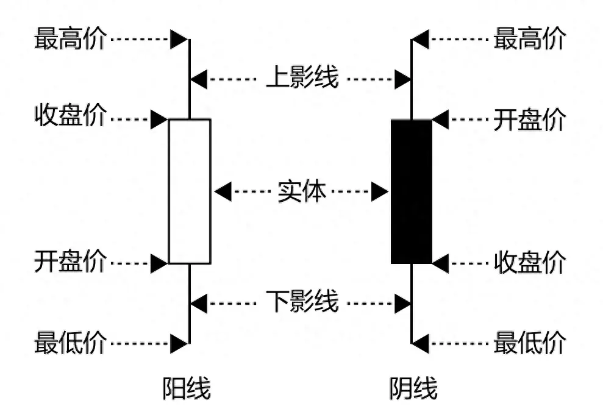

# 入门资料

## 视频

- [B站Python量化交易零基础到精通教程](https://www.bilibili.com/video/BV1bXCTBGE42?spm_id_from=333.788.videopod.episodes&vd_source=c269e1c096f9345ac4f39249e7730273&p=9)

# 基础知识

## 专业术语简介

## 一、做多和做空

### 1️⃣ 做多（Long / Buy）

* **意思**：你看好某个股票、基金或市场，认为价格会涨，于是买入它。
* **目标**：价格上涨 → 卖出获利。

**举个例子**：

* 你买入某股票，价格是 10 元/股。
* 一段时间后，价格涨到 15 元/股。
* 你卖掉 → 获利 5 元/股。

### 2️⃣ 做空（Short / Sell）

* **意思**：你看空某个股票、基金或市场，认为价格会下跌，于是先借股票卖掉，再低价买回。
* **目标**：价格下跌 → 买回还给券商，赚差价。

**举个例子**：

* 你借了 10 股某股票，每股 20 元卖掉 → 收入 200 元
* 一段时间后，股票跌到 12 元/股
* 你买回 10 股 → 支出 120 元
* 差价赚了 80 元

---

## 量化交易流程

- 量化交易流程：数据获取$\rightarrow$数据清洗$\rightarrow$策略编写$\rightarrow$策略回测$\rightarrow$策略回测$\rightarrow$策略优化$\rightarrow$模拟盘交易$\rightarrow$实盘交易
- 数据获取：

  - 行情数据
  - 宏观数据
  - 财务数据
  - 舆情数据
- 数据清洗：

  - 垃圾数据清除
  - 空值填充
  - 格式转换
  - 数据对齐
- 策略编写：
  信号捕捉$\rightarrow$交易$\rightarrow$建仓 or 平仓
- 策略回测：
  回测参数设置$\rightarrow$策略实例化$\rightarrow$历史数据载入$\rightarrow$回测执行$\rightarrow$计算盈亏$\rightarrow$计算统计指标$\rightarrow$生成回测报告
- 策略优化：

  - 重视交易费
  - 注重风险，重视退出
- 模拟盘交易：

  - 过去表现并不表示未来结果
  - 至少半年以上
  - 模拟盘稳定收益**100**%以上再考虑实盘交易
- 实盘交易：

  - 做好第一年会输的准备
  - 不急于扩大投资，增加杠杠
  - 心态最重要

## 量化交易分类体系

- 交易产品
- 盈利模式
- 策略信号

### 交易产品

- 股票策略:通过**股价波动**盈利

> 股票：股份公司为筹集资金而发行给各个股东作为持股凭证并借以取得股息和红利的一种有价证券

- 期权策略

> 期权：一种选择权，是一种能在未来某特定时间以特定价格买卖一定数量的某种特定商品的权利

- CTA策略：关注价格趋势获取利差

> 期货：一种标准化合约，其
> 期货交易所统一制定的、约定在未来的一某一个确定的日期和地点按照约定的条件买卖一定数量和质量的标的资产的标准化合约

- FOF策略

> FOF:一种专门投资于其他投资基金的基金

## 盈利模式

- 单边多空策略：**低价买进**，待股价出现单边下跌时卖出，赚取利差
- 套利策略：在金融市场利用某些**金融产品价格与收益率暂时不一致**的机会获得收益的策略。
- 对冲策略：在期货股票市场和股票市场同时进行**等量反向交易**，以锁定既得利润（或成本），通过抵消两个市场的损益来**规避股票市场的系统性风险**。

> 对冲：指特意减低另一项投资风险的投资。同时进行两笔**行情相关、方向相反、数量相当、盈亏相抵**的交易。

- 策略信号分类：
  - 多因子策略
  - 均值回策略
  - 动量效益策略
  - 二八轮动策略
  - 海龟策略
  - 机器学习策略

## 策略信号

 **交易信号**，买入或卖出的一系列特征

- 多因子策略：找到某些**和收益率最相关的指标**，并根据该指标，建一个股票组合，期望该组合在未来一段时间跑赢或跑输指数。
- 交易模型：基于现代多学科众多理论以及多种金融技术分析理论，具有普遍性，可盈利可量化可执行的交易系统。
- 机器学习：从大量数据中找到某种规律，包括但不限于文本数据，图像数据等，找到可盈利可量化可执行的策略信号。

## 股票分类

### 蓝筹股

- 经营业绩**长期稳定增长的大公司**，一般是**各个行业的龙头企业**，市值在5000亿以上，不管行业经不景气都能赚到钱，一般都有较稳定的现金分红。

### 白马股

- 长期业绩稳定、业绩成长性高，有较强的分配能力、分红不错，市值在**3000亿以下**，一般集中在消费领域。

### 成长股

- 成长性高于白马股，公司正处于**高速发展**的阶段，**业绩增长远超整个行业**，一般为有发展前景的中小公司，以高新技术和科技类的为主。

### 周期股

- 业绩随**经济周期**波动明显，多为工业基础原材料的大宗商品，机械、造船等制造业，港口、远洋运输等航运业以及汽车、房地产这样的非生活必需品行业。

### 概念股

- 具有某种特别内涵的股票，这一内涵通常会被当作一种选股和炒作题材，成为股市的热点。

## 股票行业分类

### 中证行业分类

- 中证行业分类标准相对"**官方**"，更接近监管行业分类，并同国际接轨。
- 分为11个一级行业、35个二级行业90余个三级行业及200余个四级行业。

### 申万行业分类

- 申万行业分类标准相对"**务实**"，更接近中国行业国情特征。
- 分为 31个一级行业、134个二级行业和346个三级行业。

## 股票交易基础知识

- 交易时间：周一到周五（法定节假日除外），上午9：30～11：30，下午13：00～15：00。
- 竞价成交：股票市场中确定开盘价和收盘价的一种交易机制，主要分为**集合竞价**和**连续竞价**两种。

  - 集合竞价：：在一段时间内集中接收买卖申报，最后一次性集中撮合成交。（A股）上午9:15~ 9:25:开盘集合竞价
    下午14:57~15:00:收盘集合竞价
  - 连续竞价：买单高的优先，卖单低的优先。 上午9：30～11：30，下午13：00～14:57。
- 交易单位：报价单位股， 交易单位手，**1手=100股**,股价变动单位最小为0.01元。
- 庄家与散户：

  - 庄家：能够影响金融证券市场行情的大户投资者
  - 散户：股市中投入股市资金量较小的个人投资者
- 换手率：某段时期内的成交量/发行总股数；表征该股票交易的活跃程度。10~50%非常活跃，低于1%非常不活跃。
- PE：市盈率，每股市场价格 / 每股税后利润； PE越高，该企业越被高估；反之，该企业越被低估。

## 选股

- 选股是股票投资的第一步，选股的好坏，**决定能否赚到钱**。选股方法：基本面选股
- 基本面：通过分析一家上市公司在发展过程中所面临的**外部因素以及其自身的因素**，来预测其未来的发展前景，并以此来判断该上市公司的股票是否值得买入外部因素：经济增长、财政政策、利率变化内部因素：经营状况、行业单位、财务状况**股票估值**是基本面选股的核心方法
- 常用指标说明：
  - 每股收益：**越高越好**
  - 市盈率：**同行业市盈率越低越好**；14~30倍正常，>30属于高估，50倍以上存在泡沫
  - 毛利率：越高越好，>50%属于很不错的公司
  - 净资产收益率：代表公司盈利能力。ROE长期保持在20%以上就是白马股；
  - 资产负债率：**适中为好，最好在10%~40%**
  - 净利润增速：代表公司未来成长能力；

## 择时

- 买入股票和卖出股票的时机
- 技术分析：从K线形态、成交量、均线、布林带、MACD、KDJ等方面出发分析，他们是反映股价变化的指标。
  - K线形态：显示股价的强弱、多空双方的力量对比
  - 成交量：不仅可以反映出买卖数量的变化，该可以看出多空双方的力量变化；
  - 均线：将某一段时间的手收盘价之和除以该周期所得到的一根平均线。
  - 布林带：由3条轨道线组成，上下两条线分别可以看成是价格的压力线和支撑线，在两条线之间是一条价格平均线；
  - MACD：异同移动平均线，刻画的是**股价变化的速度**；
  - KDJ:随机指标，通过价格波动的真实波幅来反映价格走势的强弱和超买超卖现象，适用于**短期行情**走势分析；

## 股价常用指标

- 极差：越高波动越明显
- 成交量加权平均价格（VWAP）：代表金融资产的“平均价格”
- 收益率：

  - 简单收益率：相邻两个价格之间的变化率；
  - 对数收益率：所有价格取对数后两两之间的差值
- 波动率：越高波动越明显

  - 年波动率：对数波动率的标准差乘以交易日倒数的平方根，通常交易日取250天
  - 月波动率：对数收益率的标准差乘以交易月的平方根，通常交易月取12月
- 均线：

  - 简单移动均线：过去一段时间的平均价格；计算股价与等权重的指示函数的卷积
  - 指数移动均线：过去一段时间的平均价格，用指数加权；计算股价与权重衰减的指示函数的卷积；

### K线图

- 用于展示一段时间内资产价格的**开盘**、**收盘**、**最高**、**最低**四个数据。
- 每根K线代表一个时间周期（如1日、1周、1小时），由三部分组成：

```text
        最高价 ─┬─  上影线
               │
        收盘价 ─┼─  ┐
（阳线）        │   │ 实体
        开盘价 ─┼─  ┘
               │
        最低价 ─┴─  下影线
```

- 两种基本形态：

| 类型           | 条件            | 颜色（常见） | 含义             |
| -------------- | --------------- | ------------ | ---------------- |
| **阳线** | 收盘价 > 开盘价 | 红色/空心    | 买盘强，价格上涨 |
| **阴线** | 收盘价 < 开盘价 | 绿色/实心    | 卖盘强，价格下跌 |

> ⚠️ 颜色习惯因平台而异：中国A股多为**红阳绿阴**；欧美常为**绿阳红阴**。



### MACD

- MACD 的全称是 **指数平滑异同移动平均线**（Moving Average Convergence and Divergence）
- MACD 由三条线和一组柱状图构成：

**MACD** 的全称是 **指数平滑异同移动平均线**（Moving Average Convergence and Divergence）。它由 **杰拉尔德·阿佩尔**（Gerald Appel）在 20 世纪 70 年代提出，是股票、期货、外汇等金融市场中最主流的技术分析指标之一。

#### MACD 的三个核心组成部分

通常在图表软件中，MACD 由三条线和一组柱状图构成：

1. **DIF 线（快线，通常为白色）**：

   - 计算方法是 **12日指数移动平均线（EMA）减去 26日指数移动平均线（EMA）**。
   - 代表短期价格相对于长期价格的动能力度。当 DIF > 0，说明短期均线在长期均线之上，处于多头（上涨）趋势。
2. **DEA 线（慢线，通常为红色）**：

   - 是 DIF 线的 **9日指数移动平均**。
   - 相当于 DIF 的“平均线”，用来平滑 DIF 的波动，提供更稳定的信号。
3. **MACD 柱状图（能量柱）**：

   - 计算公式为 **(DIF - DEA) × 2**。
   - 直观展示快慢线之间的距离。当柱线在零轴上方（正值），表示多头能量强；在下方（负值），表示空头能量强。柱子变长代表能量增强，变短代表能量衰退。

### KDJ

- KDJ (Stochastic Oscillator, 随机指标)通过比较一段时间内的**收盘价**与**价格区间**（最高价与最低价），来反映市场的**超买超卖**状态和价格动量的变化，帮助研判买卖时机。

#### 计算公式（以9日KDJ为例）

- RSV(Raw Stochastic Value, 未成熟随机值)

```text
RSV = (收盘价 - 9日内最低价) / (9日内最高价 - 9日内最低价) × 100
```

- K值
  - **快速确认线**，反应最灵敏，用于判断短期趋势变化

```text
当日 K = 2/3 × 前一日 K + 1/3 × 当日 RSV
```

- D值(慢速确认线)
  - **慢速确认线**，平滑度最高，用于确认趋势的可靠性

```text
当日 D = 2/3 × 前一日 D + 1/3 × 当日 K
```

- J值
  - **方向敏感线**，波动最大，用于识别极端超买超卖

```text
J = 3 × K - 2 × D
```

> 若无前一日K、D值，则可分别用50代替

## 策略框架

- 框架：初始化 + 策略函数(周期循环)
  - 初始化：设定投资标的（平安银行）、设定策略运行周期
  - 策略函数：例如，若上一时间点价格高出五天平均价1%，则全仓买入；若低于5天均价，则空仓卖出；

## 设置函数

- 基准：设定业绩比较基准 `set_benchmark(security)`
- 佣金/印花锐:股票类每笔交易时的手续费为：买入时佣金万分之三，卖出时佣金万分之三+千分之一印花税
- 滑点：真实成交价格与下单时预期的价格偏差 `set_slippage(object, type = None, ref = None)`
- 成交量比例：根据实际行情限制每个订单的成交量 `set_option('order_volume_ratio',value)`
- 动态复权模式：设置真实价格，建议开启 `set_option('use_real_price', value)`
- 

## 定时函数

- 设定回测和模拟交易中运行时间及频率
- 可分为：月度、周度、日度
  例：run_monthly(func, monthday, time = 'open', reference_security), func:用户自定义 `context`参数的函数，必须是全局函数；monthday：指定每月的第几个交易日执行函数。值为负数时，表示每月倒数第几个交易日执行函数；time：字符串格式；reference_security：表示时间的参照指标，

## 交易函数

- 交易数量：`order(security, amount, style=None, side='long',pindex=0)`
  security:股票代码amount:交易数量,负数表示卖出style:下单类型side:short空/long多pindex:仓位号
- 股票价值：`order_value(security, style=None, side = 'lone',pindex = 0)`
  按卖出价值为5000元的股票：`order_value('600000.XSHG', 0-5000)`
- 目标数量：`order_target(security,  style=None, side='long',pindex=0,close_today=False)`
  买入平安银行所有股票到100股：`order_target('000001.XSHG', 100)`
- 未完成订单：`get_open_orders()`
- 撤单函数：`cancel_order(order)`
- 账户出入金：`inout_cash(cash, pindex=0)`,cash：浮点数，负数表示出金

## 交易对象

- Order对象：**订单处理流程**，订单创建--> 订单检查 --> 报单 --> 确认委托 -->撮合
- Trade对象：**订单成交相关信息**，

## 策略信息

- `Context对象`：策略信息总览，包含账户、时间等信息；
- `Position对象`:输出持有的标的的信息

## 账户信息
- `Portfolio对象`:总账户信息

| 字段名称          | 类型                                         | 说明                                                                            |
| ----------------- | -------------------------------------------- | ------------------------------------------------------------------------------- |
| `long_positions`  | dict (key: 证券代码, value: [Position] 对象) | 多单仓位，key 为证券代码，value 为对应的 Position 对象                          |
| `short_positions` | dict (key: 证券代码, value: [Position] 对象) | 空单仓位，key 为证券代码，value 为对应的 Position 对象                          |
| `total_value`     | 数值型                                       | 总权益（包括现金、保证金、股票等仓位价值），用于计算收益                        |
| `returns`         | 数值型                                       | 总权益的累计收益，公式：<br>(当前总资产 + 今日出入金 - 昨日总资产) / 昨日总资产 |
| `starting_cash`   | 数值型                                       | 初始资金，当前等于 `inout_cash`                                                 |
| `positions_value` | 数值型                                       | 持仓价值                                                                        |

- `SubPortfolio对象`:子账户信息

| 字段名称            | 类型   | 说明                                                   |
| ------------------- | ------ | ------------------------------------------------------ |
| `inout_cash`        | 数值型 | 累计出入金,如初始资金1000，后来转移出去100,则这个值是1000-100                 |
| `available_cash`    | 数值型 | 可用资金，可用来购买证券的资金                         |
| `transferable_cash` | 数值型 | 可取资金，即可以提现的资金，不包括今日卖出证券所得资金 |
| `locked_cash`       | 数值型 | 挂单锁住的资金                                         |
| `type`              | 字符串 | 账户所属类型                                           |

## 财务数据
- `get_fundamentals()`函数:查询财务数据
get_fundamentals(query_object, date=None, statDate=None)\
date和dtatDate参数只能传入一个,传入date时，查询指定日期date收盘后所能看到的最近(除市值表外为最近一个季度，市值表为最近一天)的数据；传入 statDate 时，查询 statDate 指定的季度或者年份的财务数据\
query_object：一个`sqlalchemy.orm.query.Query`对象，可以通过全局的 query 函数获取Query对象。

- `query()`函数：查询数据API，可以是整张表，也可以是表中的多个字段或计算出的结果
  filter:填写过滤条件,多个过滤条件可用逗号隔开,或and,or\
  order_by:填写排序条件\
  limit:限制返回的个数\
  group_by:分组统计


- `get_fundamental_continuousl(query_object, end_date=None, count=None, panel=True)`函数:查询多日财务数据\
end_date:获取一个字符串(格式类似'2015-10-15)或者datetime对象\
count:获取end_date前count个日期的数据，count须小于500\
panel：默认panel=True，返回一个pandas.Panel；建议设置panel为False，返回等效的dataframe


## 获取成分股数据
- 指数成分股函数:查询指定指数指定日期可加以的成分股列表 `get_index_stocks(index_symbol, data=None)`\
  index_symbol:指数代码\
  data、statdate:获取一个字符串或者datetime对一项\
  返回：股票代码的list

- 行业成分股：查询指定行业的所有股票`get_industry_stocks(industry_code, data=None)`\
industry_code:行业编码\
date、statdate:获取一个字符串或者datetime对象\
返回：股票代码的list

- 概念成分股函数：查新指定概念板块的所有股票 `get_concept_stocks(concept_code, data=None)`\
  concept_code:行业编码\
  date/statdate:获取一个字符串或者datetime对象\
  返回：股票代码的list


## 标的信息
- 获取所有标的信息：获取平台支持的所有股票、基金、指数、期货、期权、信息 `get_all_securities(types=[], date=None)`\
  types:security种类，list类型。支持'stock'、'fund'、'index'、'futures'等\
  date:获取一个字符串或者datetime对象\
  返回：dataframe

- 单个标的信息：获取单个标的信息，包括中文名称，简称，上市日期等等 `get_security_info(code, date=None)`\
code:证券代码\
date:获取一个字符串或者datetime对象\
返回：返回数据对象

## 交易数据
- 获取行情数据：获取证券行情数据，可查询多个标的多个数据字段
  `get_price(securities, start_date=None, end_date=None, fields=None,frequency='daily,skip_paused=False, fq='pre),count=None, panel=True, fill_paused=False)`\

- 获取龙虎榜数据：get_billboard_list(stock_list, start_date,end_date, count)\
  stock_list:股票代码list,值为None时返回指定日期的所有股票\
  start_date:开始日期\
  end_date:结束日期\
  count:交易日数量\

## 量化选股
- 量化选股：利用数量化的方法选择股票组合，期望该股票组合能够获得超越基准收益率的投资行为
  注意事项：
    - 分配多股，减少单股重仓的情况
    - 全面研究个股基本面，增强个股判断逻辑和支撑
    - 主动投资而非被动投资
    - 只是提高胜率的工具之一

- 技术面选股：利用各种技术理论获技术指标来分析和预测股票的未来价格趋势
- 基本面选股：通过对一家上市公司在发展过程中面临的外部因素和自身因素进行分析，对其未来的发展前景进行预测，判断该上市公司的股票是否值得买进

## 营收因子选股
- 财务因子：评价企业的基本面情况，通常包括**成长类因子**，**规模类因子**，**价值类因子**以及**质量类因子**
  - 成长类因子：在财务因子选股中，常用的方法是选用成长类因子进行选股。成长类因子包括**营收因子**与**利润因子**;
    - 营收因子：包括营业收入同比增长率、营业收入环比增营业总收入
    - 利润因子：包括净利润同比增长率
、净利润环比增长率、营业利润率、销售净利润、销售毛利率
  - 规模类因子：规模类因子反映公司规模情况主要用于体现市值大小对投资收益的影响。规模类因子包括**总市值**，**流通市值**，**总股本**,**流通股本**;
  - 价值类因子：价值投资是一个久经考验的投资策略，惯例是购买那种相对低价的股票，转换成在基本面标准度量股息、账面价值、现金流或其他公司价值的方法。价值类因子包括**市净率**，**市销率**，以及**市盈率**;
  - 质量类因子：质量类因子指与股票的财务质量、资本结构相关的因子。质量类因子包括**净资产收益率**，以及**总资产净利率**;
  
- 营业收入同比增长率：(当期营业收入-上期营业收入)
/上期营业收入*100%\
`get_fundamentals(query(indicator.inc_revenue_year_on_year).filter({查询条件}).date={查询日期})`
- 营业收入环比增长率：(本期营业收入的值-上一期营业收入的值）/上一期营业收入的值*100%\
`get_fundamentals(query(indicator.inc_revenue_year_annual).filter({查询条件}).date={查询日期})`
- 营业总收入：主营业务收入+其他业务收入\
`get_fundamentals(query(indicator.ne_profit_to_total_revenue).filter({查询条件}).date={查询日期})`


- 净利润同比增长率：凈利润指企业的税后利润。\
`  (当期净利润-上期净利润)/上期净利润绝对值*100%`\
  上期凈利润指上一年度的同期凈利润

- 净利润环比增长率：`(本期净利润-上一期净利润) /上一期净利润*100%`
- 营业利润率：指经营所得的营业利润占销售净额的百分比，或占投入资本额的百分比\
`营业利润/全部业务收入*100%`
- 销售净利润：指企业实现净利润与销售收入的对比关系，用以衡量企业在一定时期的销售收入获取的能力。\
  `净利润/销售收入*100%`
- 销售毛利润：毛利是销售净收入与产品成本的差。销售毛利率是毛利占销售净值的百分比。\
  `（销售净收入-产品成本）/销售净收入`

## 规模类因子
- 规模类因子反映公司规模情况，主要用于体现市值大小对投资收益的影响，包括：**总市值**，**流通市值**，**总股本**,**流通股本**。
  - 总市值：在某特定时间内股票总价值\
  `总股本数 * 股价`\
  `get_fundamentals(query(valuation.market_cap).filter({查询条件}).date={查询日期})`
  - 流通市值：在某特定时间内当时可交易流通股票总价值\
  `可交易的流通股股数 * 股价`\
流通市值占总市值的比重（流通盘比例）越大，说明股票的市场价格越能反应出公司的真实价值\
  `get_fundamentals(query(valuation.circulating_market_cap).filter({查询条件}).date={查询日期})`
  - 总股本：指公司已发行的普通股股份总数（包括A股、B股和H股的总股本），单位万股\
  `get_fundamentals(query(valuation.capitalization).filter({查询条件}).date={查询日期})`
  - 流通股本：指公司已发行的境内上市流通、以人民币兑換的股份总数，即A股市场的流通股本，单位万股\
  `get_fundamentals(query(valuation.circulating_cap).filter({查询条件}).date={查询日期})`


## 价值类因子
- 即价值投资，是一种久经考验的投资策略。通过购买那种相对低价的股票，转换成在基本面标准度量股息、账面价值、利润、
现金流或其他公司价值的方法。价值类因子包括：**市净率**，**市销率**，以及**市盈率**。
  - 市净率：`每股市价/每股净资产`\
  一般来说市净率较低的股票，投资价值较高，相反，则投资价值较低。\
  `get_fundamentals(query(valuation.pb_ratio).filter({查询条件}).date={查询日期})`
  - 市销率：`股价/每股销售额`\
  在国内证券市场，运用这一指标来选股可以剔除那些市盈率很低但主营业务没有核心竞争力而主要是依靠非经营性损益而增加利润的股票（上市公司）。该项指标既有助于考察公司收益基础的**稳定性和可靠性**，又能有效把握其收益的质量水平\
  `get_fundamentals(query(valuation.ps_ratio).filter({查询条件}).date={查询日期})`
### 市盈率
- 市盈率数值越小，说明投资回收期越短，风险越小，分为动态市盈率和静态市盈率两种。
- 动态市盈率：指还没有真正实现的下一年度的预测利润的市盈率；\
  `动态市盈率 = 股票现价 / 未来每股收益的预测值`\
  `get_fundamentals(query(valuation.pcf_ratio).filter({查询条件}).date={查询日期})`
- 静态市盈率（广泛意义上的市盈率）：表示该公司需要累计多少年的盈利才能达到如今的市价水平;\
  `静态市盈率 = 股票现价 / 每股收益`\
  `get_fundamentals(query(valuation.pe_ratio).filter({查询条件}).date={查询日期})`

## 质量类因子
- 质量类因子指与股票的财务质量、资本结构相关的因子。影响质量因子的因素大致包括：公司的盈利能力、盈利稳定性、资本结构、成长性、会计质量、派息/摊薄、投资能力等。质量类因子包括**净资产收益率**，**总资产净利率**。
### 净资产收益率
- `税后利润/所有者权益 * 100%`
- 净资产收益率是企业税后利润除以净资产得到的百分比率，该指标反映股东权益的收益水平，用以衡量企业运用自有资本的效率。**指标值
越高**，说明投资带来的**收益越高**。
- `get_fundamentals(query(indicator.roe).filter({查询条件}).date={查询日期})`

### 总资产净利率
- `净利润/平均资产总额 * 100%`
- 总资产净利率反映的是公司运用全部资产所获得利润的水平，即**公司每占用1 元的资产平均能获得多少元的利润**。**总资产净利率越高**，**表明公司投入产出水平越高**，资产运营越有效，成本费用的控制水平越高。
- `get_fundamentals(query(indicator.roa).filter({查询条件}).date={查询日期})`

# TODO 39.10.1

---
